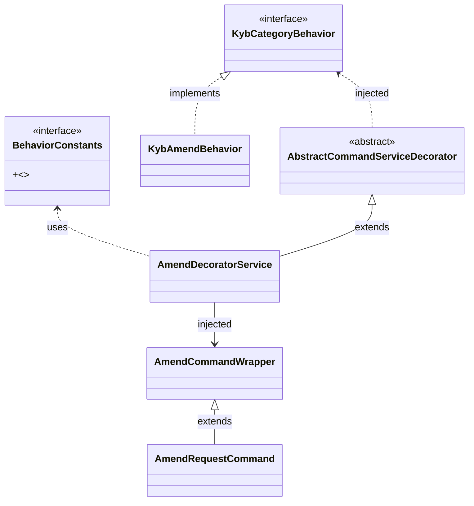

# Important Instructions

## Table of Contents
1. [Adding Functionality to Existing Feature in Submission Engine](#1-adding-functionality-to-existing-feature-in-submission-engine)  
2. [Adding APIs in RequestController](#2-adding-apis-in-requestcontroller)  

---

## 1 Adding Functionality to Existing Feature in Submission Engine

When extending existing functionality (e.g., adding new validation, transformation, or request action), developers **must follow the wrapping flow**.

---

### Why This Flow Exists
This design ensures that developers can easily **extend the amend process** by:  
- Adding new logic in the **pre-execute** phase (before the original amend flow runs).  
- Adding new logic in the **post-execute** phase (after the original amend flow finishes).  

In short, the flow provides a **decorator + wrapper pattern** that lets you inject custom functionality around the existing amend process **without breaking the original core logic**. 

### Example in Adding Functionality to Amend Flow

1. **AmendRequestCommand** defines the base command.  
2. **AmendCommandWrapper** extends it to add amend-specific logic.  
3. **AmendDecoratorService** (a service decorator) is injected into the wrapper to provide amend behaviors.  
4. **AmendDecoratorService** extends `AbstractCommandServiceDecorator`, which requires a `KybCategoryBehavior`.  
5. That **KybCategoryBehavior** is implemented by `KybAmendBehavior` (runtime logic).  
6. **AmendDecoratorService** also uses `BehaviorConstants` to standardize logic.  

---

### Why This Flow Exists
This design ensures that developers can easily **extend the amend process** by:  
- Adding new logic in the **pre-execute** phase (before the original amend flow runs).  
- Adding new logic in the **post-execute** phase (after the original amend flow finishes).  

In short, the flow provides a **decorator + wrapper pattern** that lets you inject custom functionality around the existing amend process **without breaking the original core logic**. 

#### The flow wires together commands and decorators so that request handling can be extended dynamically (via decorator) and configured by category-specific behaviors (via injected behavior implementations).

### Key Guidelines
- Always wrap new functionality in the existing flow rather than bypassing it.  
- Use the engine-provided services (e.g., request creation, update, submission, amendment, retrieval).  
- Plug into the validation, schema, and rule engine layers where necessary instead of duplicating logic.  
- Maintain auditability by ensuring all new functionality produces logs/events.  
- Ensure backward compatibility by not breaking existing flows.  

---

## 2 Adding APIs in RequestController

When creating new endpoints in the `RequestController`, you must follow strict conventions because of the request filter applied at the controller level.

### Path Structure Rule
All endpoints under `/requests` must contain the request reference immediately after `/requests/`.

**✅ Correct Example:**
PUT /requests/{reference}/amendments/resolve

markdown
Copy code

**❌ Incorrect Example:**
PUT /requests/amendments/{reference}/resolve

pgsql
Copy code

### Why This Rule Exists
- A request filter inspects the path of each API.  
- The filter uses the request reference from the path to categorize and authorize requests.  
- If the reference is not placed immediately after `/requests/`, the filter will fail, and the request will be rejected.  

---

