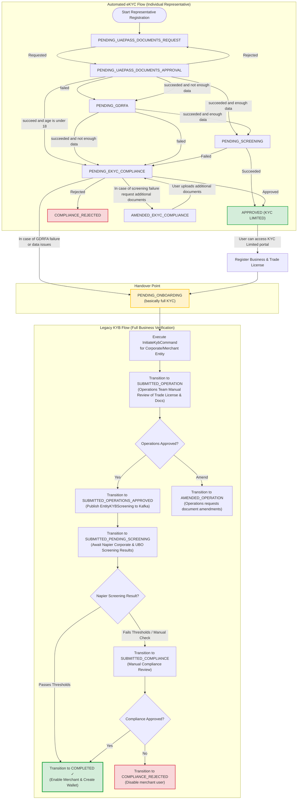

# Proposed Dual Flow: eKYC and Legacy KYB Integration

---

## 1. Executive Summary

This document proposes a unified **Dual-Flow Onboarding Architecture** for business accounts (merchants and corporates) by integrating a modern **automated eKYC (individual representative verification)** flow with our **Legacy KYB (Know Your Business)** flow.

Under this architecture:
1. **eKYC** acts as the front-end automated verification engine for the individual business representative. It uses UAE Pass document requests/approval, GDRFA residency checks, automated AML screening, and a manual eKYC compliance fallback loop.
2. **Transition/Handover to Full KYB**: If the automated eKYC verification fails due to **GDRFA failure or data issues**, the flow immediately escalates and hands over to the **Legacy KYB Flow** starting at the `PENDING_ONBOARDING (basically full KYC)` state. This triggers the comprehensive, manual corporate onboarding pipeline (verifying business trade licenses, company structures, UBOs, and deep screening).
3. **Successful eKYC**: If the automated eKYC succeeds, the user is transitioned to `APPROVED (KYC LIMITED)`.

---

## 2. Onboarding State Machine & Pipeline

The following diagram illustrates the exact eKYC state machine mapped directly from the system specification, showing all transition conditions and the handover point to the Legacy KYB flow:

View Mermaid Code

---

## 3. Detailed Step-by-Step Flow

### 3.1 Step 1: UAE Pass & Document Request
- **State**: `PENDING_UAEPASS_DOCUMENTS_REQUEST`
- **Action**: The representative initiates registration. The system triggers a document request through **UAE Pass** to retrieve the individual's verified identity documents.
- **Transition**:
  - Once the document request is enqueued/issued (`Requested` condition), the flow transitions to `PENDING_UAEPASS_DOCUMENTS_APPROVAL`.

### 3.2 Step 2: UAE Pass Document Approval & Verification
- **State**: `PENDING_UAEPASS_DOCUMENTS_APPROVAL`
- **Action**: The system awaits the user's approval on UAE Pass to fetch documents. Once retrieved, the system performs validation checks on the document payload (OCR verification, date validation, and age checks).
- **Transitions**:
  - **Rejection**: If the user rejects the request (`Rejected`), the state returns to `PENDING_UAEPASS_DOCUMENTS_REQUEST`.
  - **Happy Path**: If verification is successful and contains all necessary details (`succeeded and enough data`), the representative moves directly to **Automated Screening** in `PENDING_SCREENING`.
  - **Incomplete / Missing Data**: If the documents succeed but lack critical verified attributes (`succeeded and not enough data`), the representative is routed to **GDRFA Residency Verification** in `PENDING_GDRFA`.
  - **Verification Failure**: If the document validation fails (`failed`), the representative is routed to **GDRFA Verification** in `PENDING_GDRFA` for secondary automated validation.
  - **Minor Protection**: If the documents are verified but the representative's age is under 18 (`succeed and age is under 18`), the system escalates the request directly to **eKYC Compliance** in `PENDING_EKYC_COMPLIANCE`.

### 3.3 Step 3: GDRFA Residency Verification
- **State**: `PENDING_GDRFA`
- **Action**: The system calls the external GDRFA (General Directorate of Residency and Foreigners Affairs) API synchronously to validate residency status, visa details, and card authenticity.
- **Transitions**:
  - **Pass**: If GDRFA confirms residency and returns all necessary data (`succeeded and enough data`), the flow transitions to **Automated Screening** in `PENDING_SCREENING`.
  - **Partial Pass**: If GDRFA succeeds but fails to return enough structured fields for auto-approval (`succeeded and not enough data`), it escalates to **eKYC Compliance** in `PENDING_EKYC_COMPLIANCE`.
  - **Failure**: If GDRFA validation fails (`failed`), the flow escalates to **eKYC Compliance** in `PENDING_EKYC_COMPLIANCE`.

### 3.4 Step 4: Automated Representative Screening
- **State**: `PENDING_SCREENING`
- **Action**: The system submits the representative's verified details to the individual screening service (Napier individual check).
- **Transitions**:
  - **Screening Pass**: If screening succeeds (`Succeeded`), the representative is fully verified and reaches the terminal state **`APPROVED (KYC LIMITED)`**.
  - **Screening Failure**: If screening fails or flags potential matches (`Failed`), the flow transitions to **eKYC Compliance** in `PENDING_EKYC_COMPLIANCE`.

### 3.5 Step 5: eKYC Compliance (Manual Intervention Queue)
- **State**: `PENDING_EKYC_COMPLIANCE`
- **Action**: A manual review queue in the compliance portal where operations or compliance officers review the representative's flagged documents, age limits, or failed screening matches.
- **Transitions**:
  - **Manual Approve**: If the officer overrides and approves (`Approved`), the representative transitions to **`APPROVED (KYC LIMITED)`**.
  - **Manual Reject**: If the officer rejects (`Rejected`), the flow lands in the terminal failure state **`COMPLIANCE_REJECTED`**.
  - **Request Information**: If screening failed and the officer needs additional proof (`In case of screening failure request additional documents`), the flow transitions to `AMENDED_EKYC_COMPLIANCE`.
  - **Legacy Escalation (GDRFA/Data issues)**: If the automated verification fails due to unresolvable GDRFA failures or major data consistency issues (`In case of GDRFA failure or data issues`), the automated eKYC flow **aborts and escalates** to **`PENDING_ONBOARDING (basically full KYC)`**, handing over directly to the **Legacy KYB Flow**.

### 3.6 Step 6: Amended eKYC Compliance
- **State**: `AMENDED_EKYC_COMPLIANCE`
- **Action**: The portal notifies the user to upload specific supplemental documents.
- **Transition**:
  - Once the user uploads the requested documents (`User uploads additional documents`), the flow returns to `PENDING_EKYC_COMPLIANCE` for officer review.

---

## 4. Handover to Legacy KYB Flow

When the eKYC flow falls back to **`PENDING_ONBOARDING (basically full KYC)`** due to GDRFA or data issue escalations, or when an `APPROVED (KYC LIMITED)` representative initiates business onboarding:

1. **KYB Initial Record**: A merchant/corporate customer record is initialized on the `CUSTOMER` table. `currentReviewState` is set to `PENDING_ONBOARDING`.
2. **KYB Initiation**: The representative provides company Trade License, Registration certificates, and list of Beneficial Owners (UBOs) and Shareholders.
3. **Operations Review (`SUBMITTED_OPERATION`)**:
   - Executes `OperationSubmittedWorkflow` to create a compliance incident and Jira ticket.
   - Operations team manually reviews company documents in the compliance portal.
4. **Corporate Screening (`SUBMITTED_PENDING_SCREENING`)**:
   - Once approved by operations, the `OperationsApprovedWorkflow` triggers.
   - Company entity and all listed shareholders are submitted to **Napier** for corporate screening via the `EntityKYBScreening` Kafka event on the `napier.create.entity.kyc` topic.
5. **Final Status**:
   - If corporate screening passes, the saga transitions to `COMPLETED` (enabling the merchant on the payments side and creating business wallets).
   - If corporate screening fails, the compliance officer reviews the case under `SUBMITTED_COMPLIANCE` before moving to `COMPLETED` or `COMPLIANCE_REJECTED`.

---

## 5. Architectural Recommendations for customer-api

### 5.1 Use State Mappings in `kyc-review-state`
The shared `kyc-review-state` library should be extended to support these new eKYC states in its canonical `ReviewStateEnum`:
- `PENDING_UAEPASS_DOCUMENTS_REQUEST`
- `PENDING_UAEPASS_DOCUMENTS_APPROVAL`
- `PENDING_GDRFA`
- `PENDING_SCREENING`
- `PENDING_EKYC_COMPLIANCE`
- `AMENDED_EKYC_COMPLIANCE`
- `APPROVED_KYC_LIMITED`

### 5.2 Flow Transition Rules
The `SagaManager` inside `customer-api` can reuse the same workflow-action pattern:
- Register `eKYC` state workflows under `SagaDefinition` (e.g., `GdrfaVerificationWorkflow`, `UaePassApprovalWorkflow`).
- When a transition resolves to `PENDING_ONBOARDING`, the engine triggers a context switch from the Individual eKYC context to the Full Corporate/Merchant KYB context.

