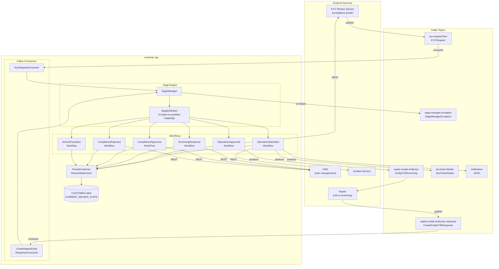
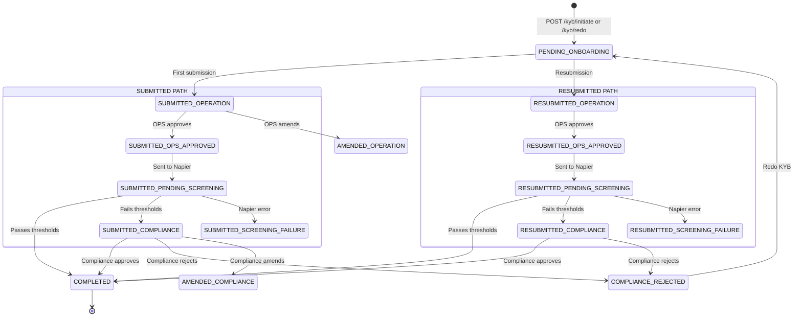
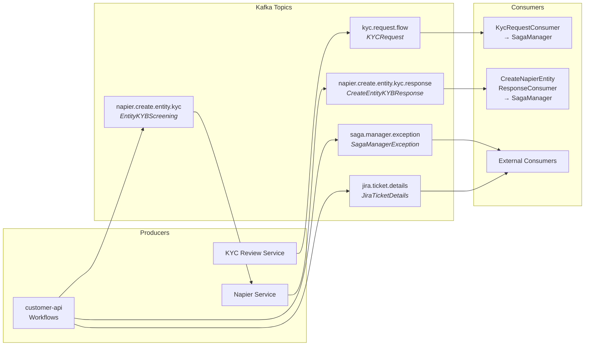
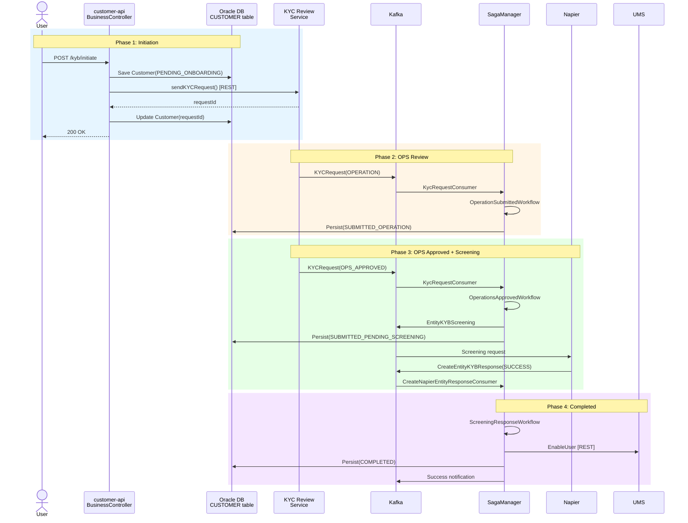
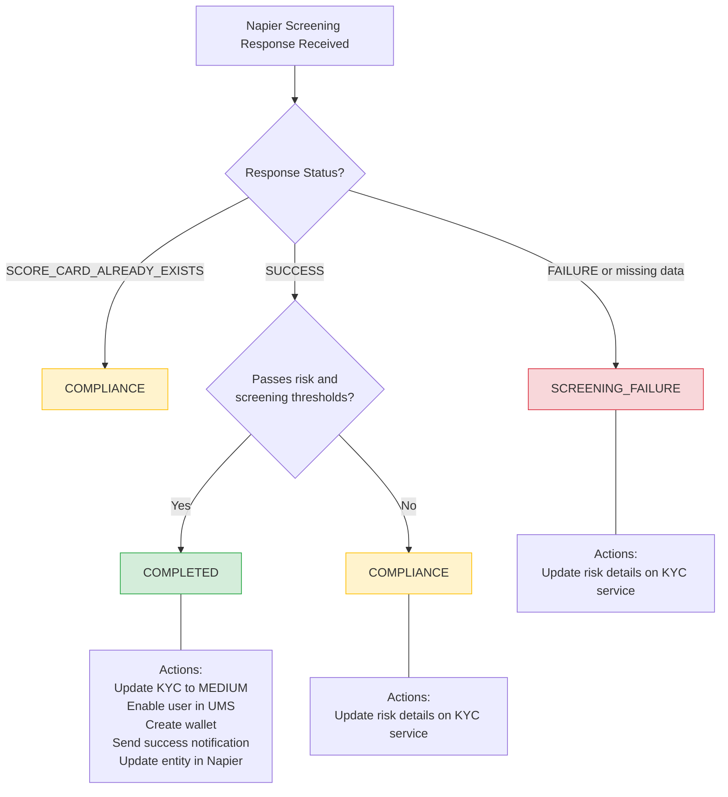
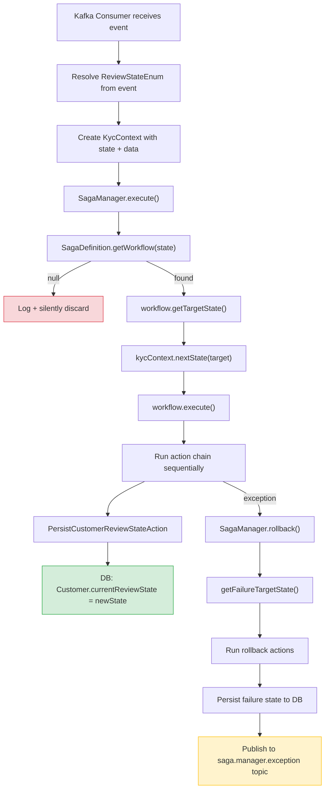
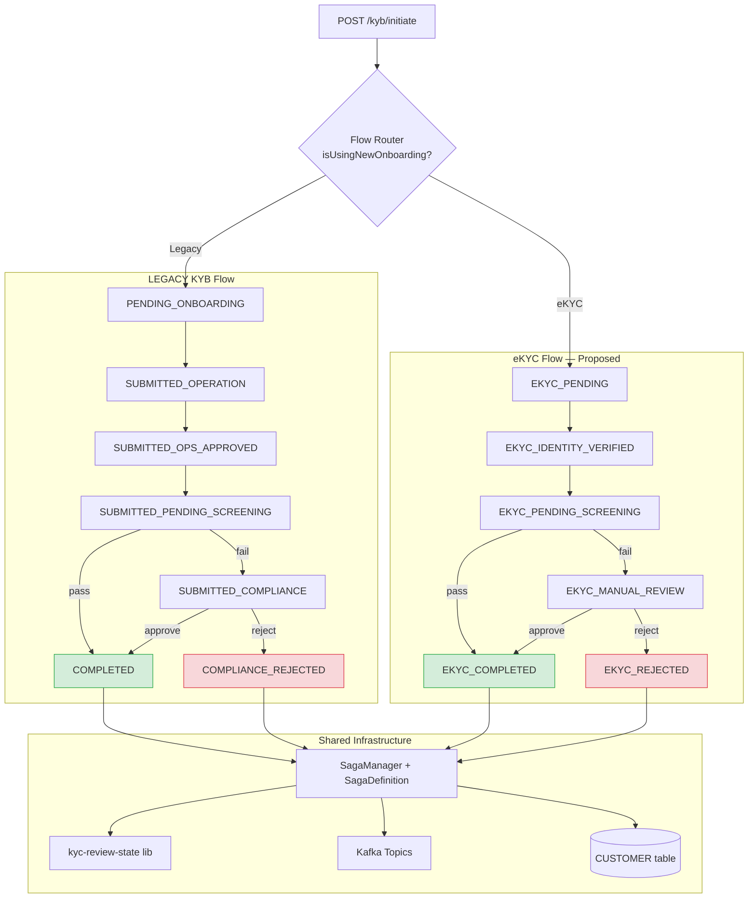

# KYB Review Status — Visual Diagrams

---

## A. KYB System Architecture

View Mermaid Code

---

## B. KYB State Transition Flow

View Mermaid Code

---

## C. KYB Kafka Event Flow

View Mermaid Code

---

## D. KYB Happy Path Sequence

View Mermaid Code

---

## E. Screening Decision Tree

View Mermaid Code

---

## F. Saga Workflow Engine Internals

View Mermaid Code

---

## G. Proposed Future: Legacy + eKYC Dual Flow

View Mermaid Code

